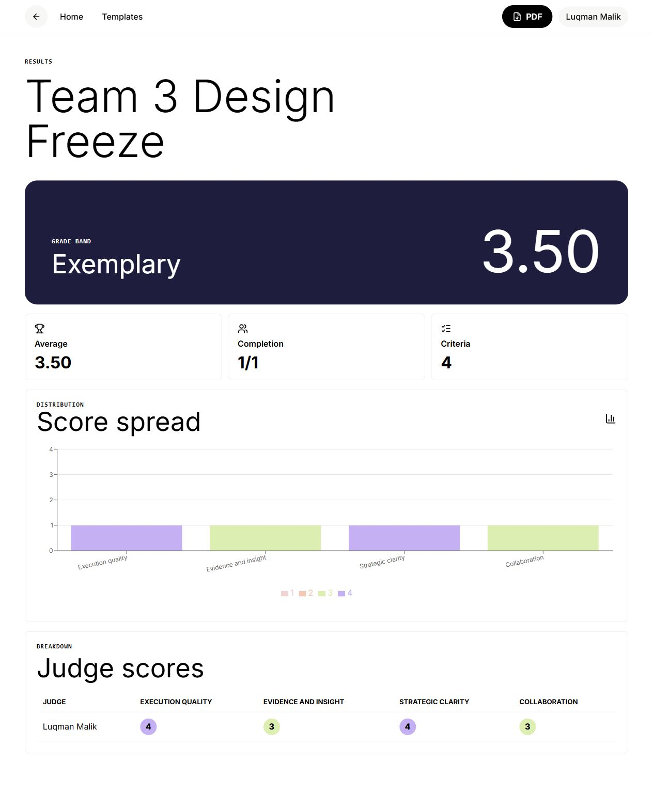

# Veto
**Mobile-first rubric scoring for fast judging sessions**

[Try it here!](https://github.com/NonStickFryingPan/veto)

---

## About

Veto is a mobile-first rubric scoring app for live judging sessions. Organizers create a session, judges join with a short code, score one criterion at a time, and review aggregated results with charts, grade bands, and a PDF export.

Built as a focused local-first prototype with a Supabase-ready schema.

## License

MIT
